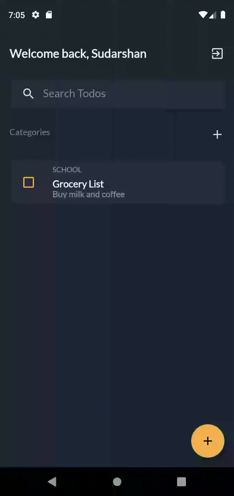

# Final Component - DMA 

This repository is for the final component of DMA which was to create a todo application with java in android studio.
The upcoming sections showcase the features implemented within the application.
**Created By: Sudarshan Bashyal (77227154)**

## Database Schema

The image below is shows the ERD for the database that was created for the application. The two entities: Todo and User 
have a one to many relationship i.e. a user can have many todos, however a single todo can only belong to one user.

---

## Startup and Authentication

Since, there is a User Entity in the database as shown in the previous section, a basic form of authentication has also been 
imlemented. 

### Splash Screen
A slash screen with a simple transition animation has been added as the launcher activity. While the animation is running in the 
foreground, the application checks if any user were logged in by checking the Shared Preferences. If a user was logged in, they
will be redirected to their main activity; if not, they will be redirected to the login activity.

### Register Account

A user can fill up a form with his full name, username, and password to register a new account.

### Register Validations

Before registering, it is ensured that the username is unique and the passwords entered by the user 
are correct and valid.

### Logging In

After a user logs in, their ID is saved within the Shared Preferences so that it is presistent even if the 
application is temrinated.

### Logging Out

Similarly, once a user logs out, their ID is then removed fromt he Shared Preferences, and they will be redirected to the login screen.

---

## TODO

This section showcases all the features related to managing todo lists. 

### Creating a Todo

When a user first creates an account, no todo is associated with his account. Hence, we can see the image that comments on the empty list.
The title, and category fields should be filled, every other field is optional.

### Toggle Todo

Todos can be toggled by clicking on the checbox. The toggle status is then immediately saved onto the database before re-rendering the list,
so that the list is always in-sync with the database.

### Update Todo

The Todo can be updated by clicking on the item which will redirect the user to the todo manager activity.

### Delete Todo

Todos can be deleted in the todo manager activity. A custom dialog box is shown to the user giving them an option to confirm the deletion.

### Swipe to Delete Todo

Todo items can also be deleted by swiping the entry from the main activity.

---

## Filtering Todo and Todo Stats
This section will get into filtering/searching todo; and will also touch on the category feature within the application.

### Searching Todo
Todos can be searched by using the SearchView. The list is updated each time the user types something.

### Todo Category Stats
The category section above the todo list can be expanded to reveal more information about the todo.
Each cateogry shows the total number of todos, and the total number of completed todos for that specific category along with a progress bar.
Toggling a todo will update the progress bar for that category as well.

---

## Collaboration
In the previous sections, we could notice a "Collaborator Username" field in the todo manager activity. This section will discuss the collaboration feature  
in detail. A user can add another user as a collaborator for any todo item that he creates. Adding a user as a collaborator will make it so that the created
todo will also appear in the collaborator's profile. However; the collaborator will be restricted from using some features. The collaborator will be able to 
see, update, and toggle the todo; but he will not be able to delete the todo or change the collaborator.

### Add a collaborator
A collaborator can be added by entering their username on the "Collaborator Username" EditText. As we can assess from the recording, when Jessica was added as the 
collaborator, the todo also appeared on her screen. The color of the checkbox in the collaborator's screen is displayed as "green" signifying that they were
collaborted on a todo.

### Change collaborator
Only one collaborotor can be added to a todo at a time. If a collaborotor has been added to a todo, a "Remove" button will be displayed which will remove the
current collaborotor from the todo. A new collaborotor can then be added by following the previous steps.

### Remove a collaborotor
A todo can also be created without adding a collaborotor, and similary even if a collaborotor has already been added, they can be easily removed. 
Doing so will make the todo not appear in their profile anymore

